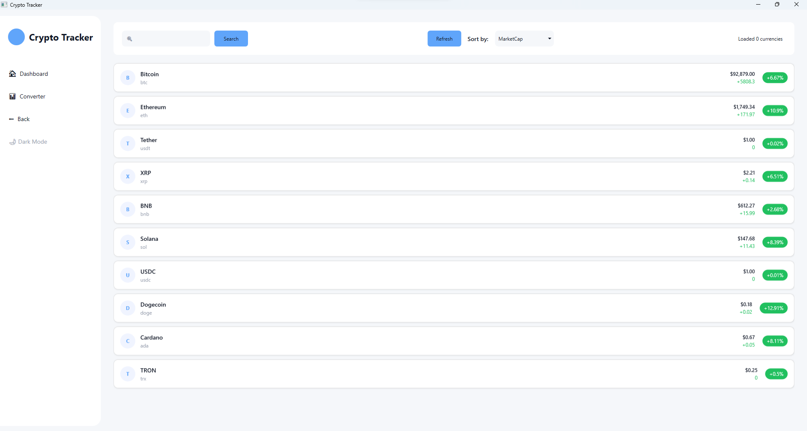

# Crypto Tracker

A modern WPF application for tracking cryptocurrency prices, charts, and market details with a clean, responsive UI.

Main Page(more images of app you can see in images folder):



## Features

- **Real-time Cryptocurrency Data**: View up-to-date pricing, market cap, and 24h changes for top cryptocurrencies
- **Detailed Coin Information**: Access comprehensive details including descriptions, price charts, and available markets
- **Price Charts**: View 7-day price history with line and candlestick chart options
- **Market Explorer**: Browse trading pairs and exchanges for each cryptocurrency
- **Currency Converter**: Convert between different cryptocurrencies with current exchange rates
- **Search Functionality**: Find specific cryptocurrencies by name or symbol
- **Theme Switching**: Toggle between light and dark themes for comfortable viewing

## Technologies & Libraries

- **WPF** - Windows Presentation Foundation for building the desktop UI
- **MVVM Architecture** - Using CommunityToolkit.Mvvm for clean separation of concerns
- **OxyPlot** - For generating interactive price charts (line and candlestick)
- **CoinGecko API** - Data source for cryptocurrency information
- **Microsoft.Extensions.DependencyInjection** - For dependency injection
- **Microsoft.Extensions.Configuration** - For app configuration

## Project Structure

- **Views**: XAML UI components
  - ShellView - Main window container
  - MainView - Dashboard with currency listings
  - CurrencyDetailsView - Detailed coin information and charts
  - ConverterView - Currency conversion tool
  
- **ViewModels**: Business logic and data binding
  - BaseViewModel - Common functionality for all view models
  - ShellViewModel - Navigation and app-wide operations
  - MainViewModel - Currency listing and search operations
  - CurrencyDetailsViewModel - Chart and ticker data operations
  - ConverterViewModel - Currency conversion logic

- **Services**:
  - CoinGeckoService - Handles API interactions
  - Data Mappers - Convert API responses to application models

- **Models**: Data structures representing cryptocurrencies and market data

- **Infrastructure**: Helper classes, converters, and utilities

## Getting Started

### Prerequisites

- .NET 8.0 SDK
- Visual Studio 2022 (recommended)

### Installation

1. Clone the repository
   ```
   git clone https://github.com/Lolluckt/DCT_TestProject.git
   ```

2. Open the solution in Visual Studio
   ```
   start CryptoTrackerApp.sln
   ```

3. Restore NuGet packages and build the solution
   
   NuGet packages:
   ```
   Install-Package CommunityToolkit.Mvvm -Version 8.4.0
   Install-Package Microsoft.Extensions.Configuration -Version 9.0.4
   Install-Package Microsoft.Extensions.Configuration.Json -Version 9.0.4
   Install-Package Microsoft.Extensions.DependencyInjection -Version 9.0.4
   Install-Package Microsoft.Extensions.Logging -Version 9.0.4
   Install-Package OxyPlot.Wpf -Version 2.2.0
   ```

5. Run the application
   ```
   dotnet run
   ```

## Configuration

The application uses `appsettings.json` for configuration. You may need to adjust API endpoints or other settings:

```json
{
  "CoinGecko": {
    "BaseUrl": "https://api.coingecko.com/api/v3/",
    "ApiKey": "your api here"
  }
}
```

## Usage

- **Dashboard**: View a list of top cryptocurrencies sorted by market cap
- **Search**: Enter a currency name or symbol in the search bar
- **Details**: Click on any currency to see detailed information and charts
- **Convert**: Use the converter tool to calculate exchange rates between cryptocurrencies
- **Theme**: Toggle between light and dark themes using the button in the side menu


## Acknowledgments

- [CoinGecko API](https://www.coingecko.com/en/api) for providing cryptocurrency data
